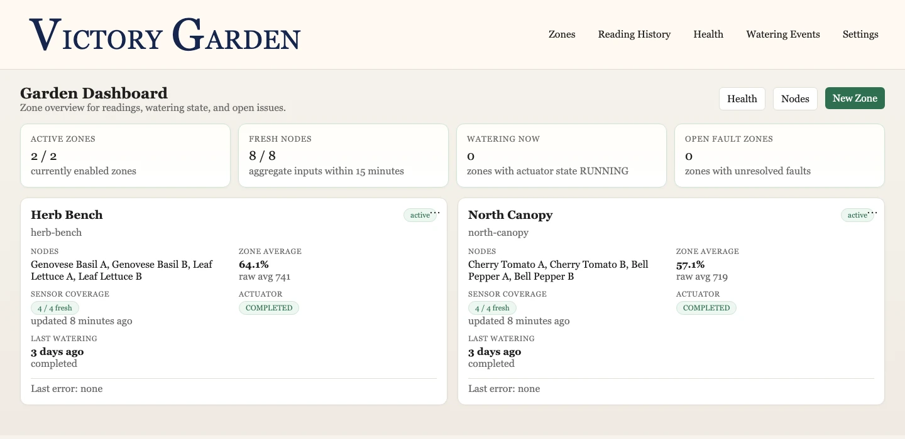
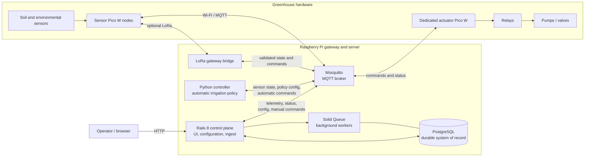
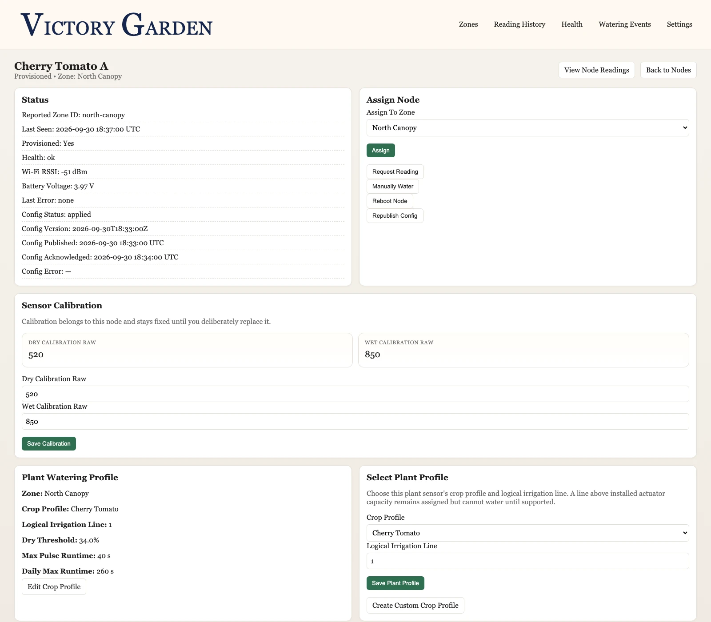
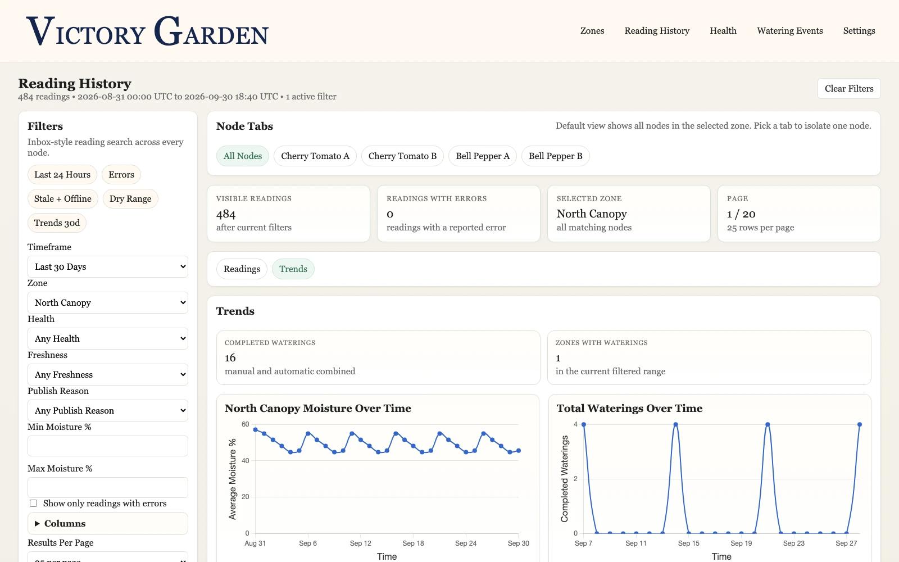
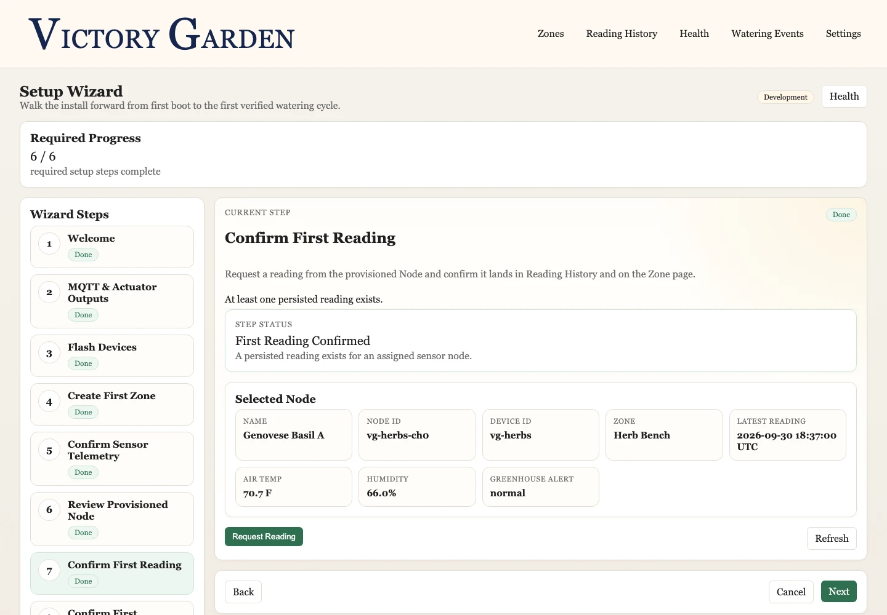

# Victory Garden

**A Rails-centered, local-first distributed control system for provisioning, monitoring, and safely coordinating greenhouse sensors and irrigation hardware.**

Victory Garden runs on a Raspberry Pi and connects a Rails 8 control plane to physical Pico W sensor and actuator nodes. Rails and PostgreSQL manage configuration, device state, history, and operator workflows; a Python controller makes automatic irrigation decisions; Mosquitto carries MQTT messages; and Pico firmware reads sensors and enforces local actuator safety.

The project began as commissioned greenhouse-automation work. I continued developing and hardening it independently after the client engagement ended.

## My role

I designed and implemented the major system components in this repository: the Rails control plane and data model, operator UI, Python automation controller, MQTT and LoRa integration contracts, Pico firmware, automated tests, provisioning workflow, and Raspberry Pi deployment tooling.

*Garden dashboard summarizing telemetry freshness, moisture, actuator state, and unresolved faults across configured zones.*

## What it solves

Automated irrigation is more than comparing a sensor reading with a threshold. The system must coordinate sleeping devices, intermittent network links, persistent configuration, historical telemetry, and physical outputs that need safe behavior even when a service disconnects or restarts.

Victory Garden provides one operator-facing control plane while keeping responsibilities explicit: PostgreSQL stores durable business state, MQTT carries live device state, Python owns automatic watering policy, and the actuator firmware provides the final runtime cutoff at the hardware boundary.

## Key features

- Provisions sensor packages, stable node identities, crop profiles, calibration values, and irrigation-line assignments.
- Ingests soil and environmental telemetry and exposes dashboard, history, trend, CSV export, and health views.
- Makes per-node automatic watering decisions using current readings, crop policy, allowed hours, and daily runtime limits.
- Supports operator-initiated readings, manual watering, configuration publication, and device reboot workflows.
- Tracks desired and acknowledged device configuration so operators can see synchronization state and failures.
- Records watering events, actuator status, command timeouts, and faults in PostgreSQL.
- Bridges optional LoRa sensor traffic into the same validated MQTT contract used by the rest of the system.
- Guides installation through browser and desktop provisioning workflows.

## Architecture

Runtime ownership is deliberate:

| Component | Responsibility |
| --- | --- |
| Rails and PostgreSQL | Configuration authority, persistence, operator UI, telemetry ingest, manual operations, and historical reporting |
| Solid Queue | Asynchronous Rails publishing, ingestion, timeout, and delayed-reread work |
| Python controller | Automatic watering decisions and automatic actuator-command publication |
| Mosquitto/MQTT | Live transport plus retained state used intentionally for device wake and replay |
| LoRa bridge | Validation and translation between compact radio frames and the canonical MQTT contract |
| Sensor firmware | Scheduled sensing, low-power behavior, configuration application, and telemetry publication |
| Actuator firmware | Node-to-output routing, command admission, relay control, and local runtime enforcement |

See the [architecture documentation](docs/architecture.md) for the detailed flows and source-of-truth rules.

## Reliability by design

- **Command correlation:** Watering and node commands carry stable correlation keys that connect publication, acknowledgements, status updates, faults, and persisted history.
- **Duplicate handling:** Database constraints and message handlers prevent repeated deliveries from creating duplicate command results or watering events.
- **Late and out-of-order responses:** Status transitions reject regressions, preserve terminal states, and still accept valid non-sequential progress when intermediate messages were missed.
- **Stale telemetry protection:** Old retained sensor readings cannot trigger automatic watering after an outage or restart.
- **Bounded failure behavior:** Publishing uses bounded retries; missing device responses become explicit timeout and fault records instead of remaining indefinitely queued.
- **Fail-closed routing:** Missing crops, irrigation lines, inactive nodes, invalid identities, and outputs beyond installed actuator capacity cannot water automatically or manually.
- **Local actuator limits:** The actuator Pico enforces the requested runtime cutoff locally and drives outputs to a safe state during boot and recovery paths.
- **Durable authority:** PostgreSQL is authoritative for topology, assignments, policy, and history. Retained MQTT messages are transport and wake/replay state, not the long-term system of record.

The detailed MQTT schemas, QoS choices, and retain rules are documented in the [MQTT contract](docs/mqtt.md).

## Tech stack

| Layer | Technologies |
| --- | --- |
| Web and control plane | Ruby 3.4, Rails 8, Hotwire, Chartkick, custom CSS |
| Data and background work | PostgreSQL, Solid Queue |
| Automation and gateways | Python 3.12+, Pydantic, paho-mqtt, PySerial |
| Messaging | Mosquitto, MQTT, optional LoRa through DX-LR22 radios |
| Firmware | C, Raspberry Pi Pico SDK, Pico W / Pico 2 W |
| Provisioning | Tauri 2, Rust, Vite, JavaScript |
| Operations | Raspberry Pi OS/Linux, systemd, shell tooling |
| Testing | MiniTest, FactoryBot, pytest, CMake/CTest host tests |

## Screenshots and demo

These views were rendered from the isolated `DEMO_SCENARIO=portfolio` workflow. All names, readings, and timestamps are synthetic; no client or production data is shown. See the [demo-data guide](docs/seed-data.md#portfolio-scenario) to reproduce the dataset locally.

<table>
  <tr>
    <td width="50%" valign="top">
       
      <strong>Node configuration.</strong> Per-node calibration, crop policy, irrigation routing, and acknowledged device state.
    </td>
    <td width="50%" valign="top">
       
      <strong>Reading trends.</strong> Thirty-day telemetry and watering trends generated from persisted sensor and actuator history.
    </td>
  </tr>
  <tr>
    <td colspan="2" align="center">
       
      <strong>Guided setup.</strong> Provisioned hardware and the first persisted sensor reading confirmed through the onboarding workflow.
    </td>
  </tr>
</table>

## Testing

Current automated validation covers normal operation and failure behavior across the application, controller, and host-testable firmware logic:

| Test surface | Latest verified result | Examples |
| --- | --- | --- |
| Rails | 511 tests, 2,295 assertions passing | Models, jobs, services, MQTT ingestion, provisioning, manual watering, operator flows, and database constraints |
| Python | 409 tests passing | Watering policy, schema validation, stale readings, state persistence, retries, LoRa routing, and packet-loss scenarios |
| Firmware host tests | 27 CTest executables passing after rebuild | Command guards, topology validation, provisioning, LoRa protocol logic, durable actuator admission, and journal persistence |

Firmware host tests do not establish electrical, GPIO, relay, sensor, sleep/wake, or RF behavior. Those behaviors require testing on the target hardware.

## Deployment

The intended installation is one Raspberry Pi running:

- Rails web and MQTT-consumer processes
- PostgreSQL
- Solid Queue workers
- Mosquitto
- the Python controller
- the LoRa receiver/bridge when enabled
- supporting discovery and systemd services

Sensor Pico packages and one dedicated greenhouse-wide actuator Pico communicate with that local server. The installer prepares dependencies, databases, environment configuration, services, and firmware bundles; routine updates rerun the installer after pulling source changes.

See the [Pi deployment guide](deploy/README.md) and [one-zone quick start](docs/quickstart.md).

### Security boundary

The current Rails application does not provide user authentication. It is designed for a trusted local network and should not be exposed directly to the public internet without an explicit authentication, authorization, TLS, and network-security design.

## Current status and limitations

### Implemented and test-covered

- Rails configuration, provisioning, telemetry, health, history, and manual-operation surfaces.
- Python automatic watering policy and MQTT command publication.
- Sensor and dedicated-actuator firmware, shared message contracts, and host-side safety tests.
- Raspberry Pi installation, service management, broker authentication, and release packaging.

### Bench validated

- Pico-to-Pi inbound LoRa sensor telemetry through a DX-LR22 radio and the MQTT bridge.
- Selected end-to-end device command and reboot behavior documented in the firmware manual test log.

### Remaining validation and follow-up work

- Final physical actuator output capacity and full relay, pump/valve, and sensor behavior on the target installation.
- Physical RF validation of the LoRa-primary receive and command path.
- Broader device-replacement workflow polish and a long-term historical-data retention policy.
- Durable automatic-command producer identity across Python controller restarts remains deferred.

Unsupported or incomplete configuration fails closed rather than enabling watering. See [Current Project Status](docs/architecture.md#current-project-status) for the canonical status summary.

## Documentation

- [Architecture and runtime ownership](docs/architecture.md)
- [MQTT contract and retain rules](docs/mqtt.md)
- [Setup guide](docs/setup.md)
- [One-zone quick start](docs/quickstart.md)
- [Raspberry Pi deployment](deploy/README.md)
- [Hardware validation log](firmware/MANUAL_TEST_LOG.md)

## Repository map

| Path | Purpose |
| --- | --- |
| [`ruby_service/`](ruby_service) | Rails control plane, operator UI, PostgreSQL models, jobs, and MQTT ingestion |
| [`python_tools/`](python_tools) | Automatic controller, LoRa bridge, provisioning helpers, simulations, and tests |
| [`firmware/pico_w_sensor_node/`](firmware/pico_w_sensor_node) | Production sensor-node firmware |
| [`firmware/pico_w_actuator_node/`](firmware/pico_w_actuator_node) | Greenhouse-wide dedicated actuator firmware |
| [`firmware/pico_w_combined_node/`](firmware/pico_w_combined_node) | Development and demonstration firmware, not the production topology |
| [`desktop_installer/`](desktop_installer) | Desktop setup and Pico-flashing workflow for split sensor/actuator hardware |
| [`desktop_installer_combined/`](desktop_installer_combined) | Development/demo provisioning workflow for combined-node hardware; not the production topology |
| [`firmware-bundles/`](firmware-bundles) | Prebuilt Pico artifacts consumed by installer and release tooling |
| [`contracts/`](contracts) | Shared payload examples used across runtimes and tests |
| [`deploy/`](deploy) | Raspberry Pi installation, service, image, and release tooling |
| [`docs/`](docs) | Architecture, protocol, setup, calibration, wiring, and operations references |
